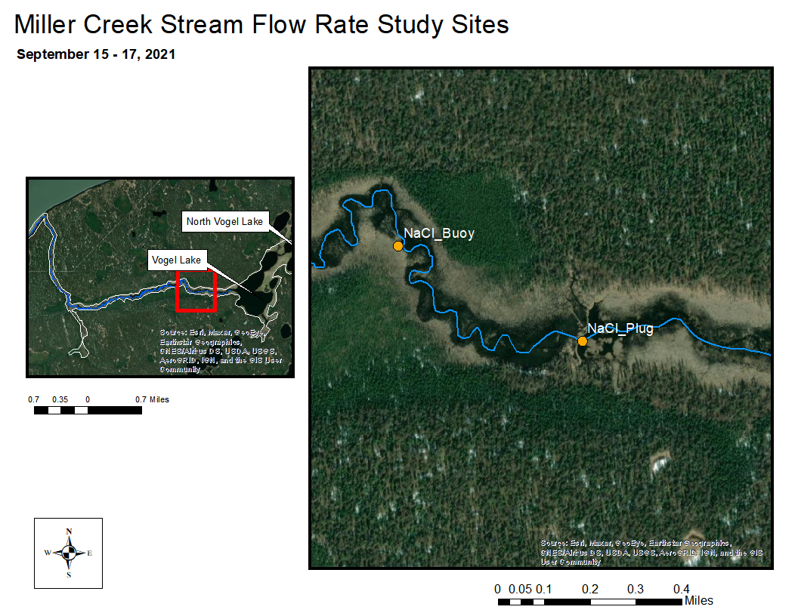

# Miller Creek Discharge & Flow Rate

### Introduction

Hydrology fieldwork focusing on flow and discharge is being conducted throughout the Miller Creek drainage in Fall 2020 - Spring 2021.

-   Near the mouth of Miller Creek, a discharge measurement station was installed in October 2020. At this site a pressure transducer measures water level, and discharge measurements are collected periodically using a SondeTek FlowTracker Acoustic Doppler Velocimeter. These data, along with staff plate observations, are being used to create a rating discharge curve.

-   An experiment to study stream flow rate in Miller Creek was conducted September 15-17, 2021. A plug of dissolved salt (NaCl) was discharged in to the creek, and the resultant spike in conductivity was observed downstream 0.64 km stream distance.

Raw water quality field data is stored in a Google Sheet that can be viewed at <https://tinyurl.com/kwf-vogel-wqx-data> under the "Discharge Measurements" tab.

Site photos are available through a point-and-click pop-up map at <https://arcg.is/199PPj>.

```{r setup_02, include=FALSE}
knitr::opts_chunk$set(echo = TRUE, warning = F, message = F)

# clear environment
rm(list=ls())

# load packages
library(bookdown)
library(tidyverse)
library(googlesheets4)
library(lubridate)
library(readr)
library(readxl)
library(writexl)
library(hms)
library(plotly)
library(DT)
library(xlsx)
library(leaflet)
library(DT)
library(ggpubr)
library(plotrix)
library(packrat)
library(ggpmisc)

# set plotting themes

## geom_col plots theme
col_theme <- theme(axis.title = element_text(size = 14, face = "bold"),
                   strip.text = element_text(size = 14, face = "bold"),
                   legend.title = element_text(size = 14, face = "bold"),
                   legend.text = element_text(size = 14),
                   axis.text = element_text(size = 14))

## geom_points plots theme
points_theme <- theme(axis.title = element_text(size = 14, face = "bold"),
                   strip.text = element_text(size = 14, face = "bold"),
                   legend.title = element_text(size = 14, face = "bold"),
                   legend.text = element_text(size = 14),
                   axis.text = element_text(size = 11, face = "bold"),
                   title = element_text(size = 18))

# function to exclude multiple items per column
'%ni%' <- Negate('%in%')

# clarify select function
select <- dplyr::select
```

```{r, include = F}

# recognize sheet title and download
discharge_dat <- read_sheet("https://docs.google.com/spreadsheets/d/1lS9eJ7kX91IlYwSgiEQm-BQqif_7o5E4MzcBmqpwSoI/edit#gid=0", 
                           sheet = "Discharge_Measurements") %>%
  # rename columns
  rename(site = `Site Name`,
         sample_date = `Sample Date`) %>%
  # select needed columns
  select(site,
         sample_date,
         Staff_Plate_Height,
         Q_Discharge_cfs) %>%
  # transform column formats
  transform(Staff_Plate_Height = as.numeric(Staff_Plate_Height),
            Q_Discharge_cfs = as.numeric(Q_Discharge_cfs)) 

  # select miller creek pressure transducer site 1
miller_discharge_dat <- discharge_dat %>%
  filter(site == "Miller Creek Pressure Transducer 1")

# save
write.csv(miller_discharge_dat,"output/discharge_results/csv_miller_creek_discharge.csv", row.names = F)

```

<br>

### Methods

#### Miller Creek Discharge Rating Curve

A discharge station was established in October 2020 near the mouth of Miller Creek, including a staff plate and Orpheus Mini pressure transducer.

Site visits were made opportunistically depending on precipitation throughout Summer/Fall 2021, and once each in Spring 2022 and Fall 2022. At each site visit, the pressure transducer is downloaded and a typically a discharge measurement is also collected using a SondeTek Flowtracker Acoustic Doppler Velocimeter. See Figure \@ref(fig:ratingcurve1) for the discharge rates and staff plate values observed to date.

A total of seven discharge measurements at the Miller Creek mouth site were made between Fall 2020 and Spring 2022. A curve was fit to the scatter plot of stage height vs. discharge.

```{r rating-curve, eval = F, echo=FALSE, fig.cap="Measurements for Miller Creek Discharge Rating Curve"}

# notes:
# this chunk iset to not evaluate in the report due to technical difficulties:
## a.) the ggpmisc equation annotation functions do not appear to work for plotly visualizations. How to annotate plotly with equations?! ggplot show regression equation
## the curve formula appears to be incorrect
## data are instead organized and made available in a downloadable Excel file


ggplotly(
  p <- miller_discharge_dat %>%
  ggplot(aes(Staff_Plate_Height, Q_Discharge_cfs, label = sample_date)) +
  geom_point() +
  geom_smooth(method = "nls", formula = y ~ a*log(x)+b, se = F) +
  stat_poly_eq(aes(label = after_stat(eq.label))) + 
  ggtitle("Miller Creek\nMeasurements for Discharge Rating Curve")
  )

# show in ggplot static
miller_discharge_dat %>%
  ggplot(aes(Staff_Plate_Height, Q_Discharge_cfs, label = sample_date)) +
  geom_point() +
  geom_smooth(method = "gam", formula = y ~ log(x), se = F) +
  stat_poly_eq(aes(label=paste(..eq.label..,..adj.rr.label.., sep = "~~~")), label.x = 1, geom="label",parse=TRUE) +
  ggtitle("Miller Creek\nMeasurements for Discharge Rating Curve")


```

The rating curve for the outlet of Miller Creek and it's source data may be accessed from the downloadable Excel file below:

```{r, echo = F}
xfun::embed_file("output/discharge_results/miller_creek_discharge.xlsx", name = "Miller Creek Outlet Rating Curve Data")
```

```{r, ratingcurve1, echo = F, fig.cap= "Miller Creek Discharge observations vs. Staff Gauge Height"}
knitr::include_graphics("output/discharge_results/discharge_rating_curve_20220912/Slide1.jpg")
```

```{r, ratingcurve2, echo = F, fig.cap= "Miller Creek Discharge observations vs. Pressure Transducer Values"}
# next: get relationship between PT data and discharge, then apply this relationship to get continuous discharge data
knitr::include_graphics("output/discharge_results/discharge_rating_curve_20220912/Slide2.jpg")

```

<br>

#### Pressure Transducer Data

An Orpheus Mini pressure transducer (PT) was deployed at the mouth of Miller Creek from October 2020 through current day (as of `r Sys.Date()`). Values were logged at 0.25 hr intervals.

We plotted staff plate observations with their simultaneous pressure transducer (PT) records and fit a linear regression. The resulting relationship (y = 0.0122x - 0.0592), where y is the PT value and x is stream discharge) can be used to translate the pressure transducer time series into a stream discharge time series, also known as a flow hydrograph (\@ref(fig:ratingcurve2)) following the basic approach outlined in [Covino et al. 2020](https://rpubs.com/kwf/hydrographs_covino)[^02-miller_creek_discharge-1][.](https://rpubs.com/kwf/hydrographs_covino)

[^02-miller_creek_discharge-1]: <https://rpubs.com/kwf/hydrographs_covino>

Notes and caveats on data inputs to the flow hydrograph for Miller Creek:

1.  The quantity of paired discharge measurements and staff plate observations (7) is less than the minimum quantity desired (8) to record a rating curve.

2.  The linear relationship does not meet assumptions of statistical normality typically applied for such circumstances. The low number of discharge observations is a result of the remote location of the project site and the challenging logistics required to visit. While additional field observations would create more precise discharge values, the general shape of the flow time series would remain unchanged.

3.  Some pressure transducer time series data is either missing or should be excised for reasons including being affected by ice, exposure to air, or device removal due to concerns of site stability. Non-useful time periods are summarised in the downloadable table below.

```{r echo = F}
xfun::embed_file("output/discharge_results/miller_creek_discharge_excise.csv", name = "Download Miller Creek Pressure Transducer Data Missing / Excised Time Periods")
```

<br>

As of `r Sys.Date()`, an insufficient number of discharge observations exist to make a reliable discharge rating curve for Miller Creek. As a result, the pressure transducer data in \@ref(fig:ptdata) is shown in raw form rather than as converted to stream discharge values.

Currently, available field observations produce a rating curve that translates to streamflow estimates ranging from 2.6 cfs to 187.3 cfs. These are likely an unreasonable estimate, given that the range of discharge values observed throughout the project (2021 - 2022) was between 4 cfs and 35 cfs.

Kenai Watershed Forum staff will continue to visit the site opportunistically throughout Summer 2023, and aim to gain sufficient discharge observations to create a reliable rating curve. We will consult with state and federal agency hydrologists to determine if alternative methods may be applied to develop a rating curve. These data may be useful in understanding management needs for potential future pike barriers.

```{r, include = F}
# directories by date

## to do: tidy up the file read-in process

## 20210524 site visit / download
dir <- "input/pressure_transducer_data/20210524/"
  
# parameter 1
`0001_20201014` <- read_csv(paste0(dir,"0001_20201014.csv"))

# parameter 2
`0002_20201014` <- read_csv(paste0(dir,"0002_20201014.csv"))

# join parameters together
`20201014` <- left_join(`0001_20201014`,`0002_20201014`) %>%
  transform(date = dmy(date))


## 20210624 site visit / download
dir <- "input/pressure_transducer_data/20210624/"

# parameter 1
`0001_20210624` <- read_csv(paste0(dir,"0001_20210624.csv"))

# parameter 2
`0002_20210624` <- read_csv(paste0(dir,"0002_20210624.csv"))

# parameter 3
`0003_20210624` <- read_csv(paste0(dir,"0003_20210624.csv"))

# join parameters together
`20210624` <- left_join(`0001_20210624`,`0002_20210624`) %>%
  left_join(`0003_20210624`) %>%
  transform(date = dmy(date))


## 20220515 site visit / download
dir <- "input/pressure_transducer_data/20220515/"

# parameter 1
`0001_20220515` <- read_csv(paste0(dir,"0001_20220515.csv"))

# parameter 2
`0002_20220515` <- read_csv(paste0(dir,"0002_20220515.csv"))

# parameter 3
`0003_20220515` <- read_csv(paste0(dir,"0003_20220515.csv"))

# join parameters together
`20220515` <- left_join(`0001_20220515`,`0002_20220515`) %>%
  left_join(`0003_20220515`) %>%
  transform(date = dmy(date))


## 20221002 site visit/download
dir <- "input/pressure_transducer_data/20221002/"

# parameter 1
`0001_20221002` <- read_csv(paste0(dir,"0001_20221002.csv"))

# parameter 2
`0002_20221002` <- read_csv(paste0(dir,"0002_20221002.csv"))

# parameter 3
`0003_20221002` <- read_csv(paste0(dir,"0003_20221002.csv"))

# join parameters together
`20221002` <- left_join(`0001_20221002`,`0002_20221002`) %>%
  left_join(`0003_20221002`) %>%
  transform(date = dmy(date))


### join all download dates to single dataframe
pt <- bind_rows(`20201014`,`20210624`,`20220515`,`20221002`) %>%
  # format time to hms
  mutate(foo = as_hms(paste0(time,":00"))) %>%
  select(-time) %>%
  rename(time = foo) %>%
  # create datetime column
  mutate(datetime = ymd_hms(paste(date, time))) %>%
  # make parameter values numeric
  transform(parameter1 = as.numeric(parameter1),
            parameter2 = as.numeric(parameter2),
            parameter3 = as.numeric(parameter3)) %>%
  # make long format
  pivot_longer(cols = contains("parameter"),
               names_to = "param",
               values_to = "val") %>%
  # eliminate duplicate observations
  distinct() %>%
  #filter(!is.na(val)) %>%
  # remove "parameter3", which is not applicable
  filter(param != "parameter3") %>%
  # add site name, year, and yday
  mutate(site = "miller_creek_streamflow",
         year = year(date),
         day = yday(date)) 
  
```

<br>

```{r, echo = F}
library(anytime)
library(magrittr)

# plot raw pt time series with bad data excised

# read in and prep excise table
pt_excise <- read.csv("output/discharge_results/miller_creek_discharge_excise.csv") %>%
  select(-notes) %>%
  filter(!is.na(start_day))

# use anti_join approach as outlined in thermal imagery example
flagged_data <- inner_join(pt,pt_excise,by = c("param","site","year")) %>%
# apply useData = 0 flags to flagged data (e.g. do not use this data)

  filter(day >= start_day & day <= end_day) %>%
  mutate(useData = 0) %>%
  select(-start_day,-end_day)

# apply useData = 1 to non-flagged data
 nonflagged_data <- anti_join(pt,flagged_data) %>%
  mutate(useData = 1)

# rejoin flagged and non-flagged data in same dataframe
pt <- bind_rows(flagged_data,nonflagged_data) 
 
# convert useData == 0 to val = NA; keep datetime stamp
pt %<>% 
 # mutate(val1 = na_if(val,useData == 0))
  mutate(val = if_else(useData == "0", NA_character_,as.character(val)))
  

# plot

# issues:
# - y axis tics are nonsensical
# - missing time periods for unclear reasons
# - possible overlap w two time series

```

```{r ptdata, echo = F}
p <- pt %>%
    filter(param == "parameter2",
           val > -0.1,
           !is.na(val),
           useData == 1) %>%
#   create hourly average values to smooth visualization
    #group_by(datetime_round = floor_date(datetime,"day")) %>%
    #summarise(mean_val = mean(val, na.rm = T)) %>%
  # plot
  ggplot(aes(datetime,as.numeric(val))) +
  geom_point() +
  ggtitle("Miller Creek Pressure Transducer Fall 2020 - Fall 2022") +
  xlab("Date") +
  ylab("Pressure Transducer Value") 
p
#ggplotly(p)
```

```{r, echo = F}

# plot as PT converted to discharge
#p <- pt %>%
#    filter(val > -0.1,
#           !is.na(val)) %>%
#   create hourly average values to smooth visualization
#    group_by(datetime_round = floor_date(datetime,"day")) %>%
#    summarise(mean_val = mean(val, na.rm = T)) %>%

    # apply conversion from PT values to discharge values
#    mutate(mean_Q = 53.437*mean_val^.5179) %>%
  
#  ggplot(aes(datetime_round,mean_Q)) +
#  geom_path() 


# y = 0.0122x - 0.0592
# x = (y + 0.0592)/0.0122
# resultant discharge values are an order of magnitude past realistic.

# new
# Q = 53.457pt^0.5179

# notes: stream discharge values produced from this conversion are unrealistic.
```

<br>

#### Discharge measurements at other sites

Additional discharge measurements were taken throughout Summer 2021 at two additional sites near Vogel Lake, near the outlets of Kuguyuk Pond and Bird Pond. See Figure \@ref(fig:other-discharge) for discharge values observed to date.

```{r other-discharge, echo=FALSE, fig.cap="Other discharge measurements"}
#plot 
ggplotly(
  p <- discharge_dat %>%
  filter(site %in% c("Bird Pond Discharge Site", 
                     "Kuguyuk Pond Discharge Site")) %>%
    ggplot(aes(as.factor(sample_date),Q_Discharge_cfs)) +
    geom_point() +
    facet_grid(. ~ site) +
    xlab("") +
    ylab("Stream Discharge Rate (cfs)") +
    ggtitle("Additional Discharge Measurement Sites")
)


```

<br>

#### Stream Flow Rate Experiment

On September 15-17, 2021 we conducted an experiment to examine stream flow rate in Miller Creek. We measured downstream transport time of dissolved solutes by deploying a plug of dissolved salt and measuring a resultant change in conductivity at a site downstream. We deployed a plug of dissolved salt into the Miller Creek stream channel and measured conductivity continuously at a downstream site. See Figure \@ref(fig:nacl-map) for salt deployment and conductivity monitoring sites.

<br>

```{r nacl-map, echo = FALSE, fig.cap="Stream Flow Rate Study Area. Stream distance between the NaCl release site and the downstream measurement site is 0.63 km (0.39 mi)."}

```

<br>

The Vogel Lake / Miller Creek system is a low-gradient drainage with little observable flow within 0.5 miles downstream of the lake outlet. We deployed our salt plug downstream from the Vogel Lake outlet at the first site with visibly evident surface flow, which was over the top of the first downstream beaver dam.

We released 140 lbs of dissolved NaCl by dissolving appx 15 lbs at a time in a 35 gallon trash can, then discharging it on the downstream side of the beaver dam into the stream channel. Our downstream site monitoring conductivity was 0.63 km (0.39 mi) downstream center-channel.

To record conductivity we used a pair of simultaneously deployed Hydrolab MS5 Sondes suspended from a floating buoy. We programmed the sondes to record at 0.25 hour intervals. We examined the resultant time series for exposure or errors and removed these data points. We averaged conductivity values between the two Hydrolab units in the final results.

```{r echo = FALSE, message = FALSE}
# read in raw csv files and bind together
hl1 <- read.csv("input/hydrolab_data/nacl_buoy_site/46005_Miller_NaCl.csv",
                skip = 14) %>%
  select(-X.2,-X.4,-X.6,-X.7) %>%
  mutate(id = 46005)


hl2 <- read.csv("input/hydrolab_data/nacl_buoy_site/64821_Miller_NaCl.csv",
                skip = 14) %>%
  select(-X.2,-X.4) %>%
  mutate(id = 64821)

hl <- bind_rows(hl1,hl2) 
colnames(hl) <- c("date","time","temp_C","cond_uScm","id")

# prep for analysis
hl <- hl %>%
  mutate(datetime = mdy_hms(paste(date,time)))%>%
  # round all times to nearest minute
  mutate(datetime = round_date(datetime, unit = "minute")) %>%
  # average values between two sondes
  group_by(datetime) %>%
  summarise(mean_cond_uScm = mean(cond_uScm))

```

<br>

##### Streamflow Rate Results

We measured a readily evident rise in conductivity values at the downstream monitoring site. See Figure \@ref(fig:nacl-fig) for the time series of conductivity data.

```{r nacl-fig, echo=FALSE, fig.cap= "Conductivity values at the site downstream of the NaCl release site. The NaCl plug was released at 19:30 on 9/15/2021. The release and measurement site coordinates can be accessed at the ArcGIS Online Map at https://arcg.is/199PPj."}
ggplotly(
  p <- hl %>%
  ggplot(aes(datetime,mean_cond_uScm)) +
  geom_point() +
  ylim(70,140) +
  xlab("Date/Time") +
  ylab("Conductivity (uS/cm)") +
  ggtitle("Conductivity vs. Time\nat site 0.39 mi Downstream From Salt Deployment")
  )

```

In Figure \@ref(fig:nacl-fig) we can observe the following:

-   [Initial NaCl Deployment:]{.underline} 9/15/2021 19:30

-   [Start of the rising limb of the conductivity spike:]{.underline} 9/15/2021 22:00 (2.5 hrs after deployment)

-   [Maximum conductivity peak (\~20% above baseline values):]{.underline} 01:30 9/16/2021 (6.0 hours after deployment)

-   [Return to baseline conductivity levels:]{.underline} 9/16/2021 15:00 (19.5 hrs after deployment)

Based on these results, peak concentration of the dissolved solute traveled though this section of Miller Creek at [**0.11 km/h (0.06 mph)**]{.underline}.
