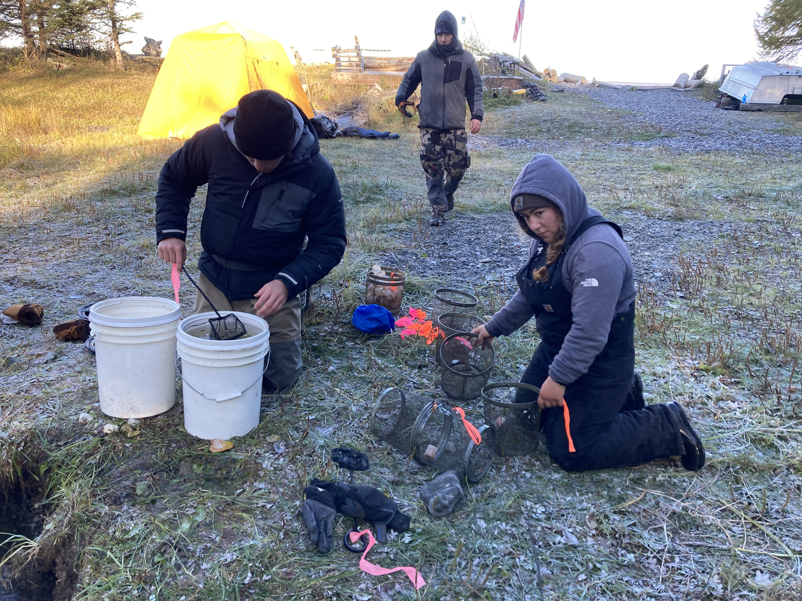
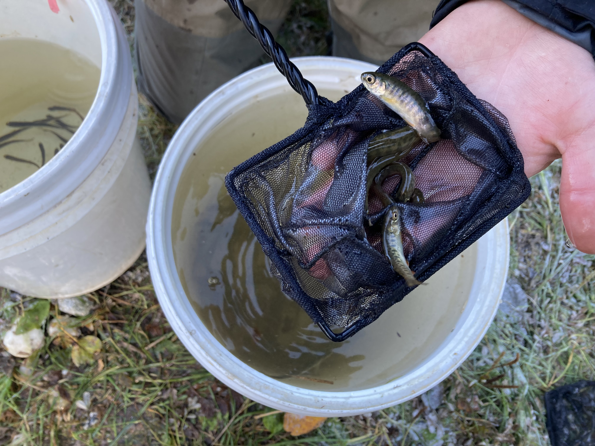

# Fish Rescue


## Summary
On September 27-29, 2021, staff from Kenai Watershed Forum and Cook Inlet Aquaculture Association led fish rescue efforts in Lower Miller Creek prior to rotenone treatment. We used minnow traps to capture juvenile fish, which were later transported by helicopter to Bird Pond for winter residency until post-treatment rotenone levels decrease to safe levels. A fish barrier currently at the outlet of Bird Pond will be removed in Summer 2022 pending confirmation of safe conditions.

## Methods
We captured juvenile fish in the segment of Miller Creek extending from it's mouth at Cook Inlet to a location upstream approximately 1.3 km from the mouth, N 60.99530, W -150.50760. 

We used Gee minnow traps baited with cured, disinfected salmon eggs. We placed eggs placed inside perforated canisters to prevent consumption by the fish. We placed minnow traps in locations known to be preferred by juvenile salmonids, including areas with woody debris, pools, and areas with riparian cover. We deployed traps for time periods of 6-12 hours at a time, and returned with all captured fish in five-gallon buckets to a central location. We identified all captured fish to genus or species for the purpose of ensuring that no juvenile pike were included in the captured population.

After identifying fish taxa, we stored juvenile fish in three perforated five gallon buckets submerged within the creek on site. We placed stones at the bottom of each bucket to keep them submerged. These fish were stored until being retrieved by helicopter for transport to Bird Lake on 10/1/2021.

## Results

```{r, rescue-tbl, echo = F, fig.cap="Lower Miller Creek, estimated fish rescue effort and capture data from September 2021."}

# read in table
tbl <- read_excel("input/fish_rescue/fish_rescue_data.xlsx") 

knitr::kable(tbl, caption = "Minnow trap deployment and fish capture, estimated data from Lower Miller Creek")

```

<br>

Table \@ref(tab:rescue-tbl) summarizes capture and effort data for fish rescue efforts in Lower Miller Creek. Due to limited available staff as a result of the COVID-19 pandemic, minimal formal data on fish capture was recorded in order to focus primarily on maximizing the quantity of fish captured prior to rotenone treatment. As a result, values in table \@ref(tab:rescue-tbl) are estimates rather than exact quantities.

Fish captured from Lower Miller Creek were identified to species by ADF&G staff prior to placement into Bird Pond, although these fish were not segregated from fish also captured in the Vogel Lakes complex and Upper Miller Creek. Table \@ref(tab:spp-tbl) provides total capture counts for fish rescue efforts throughout the Miller Creek/Vogel Lakes complex.

<br>

```{r, spp-tbl, echo = F, fig.cap="Lower Miller Creek fish rescue effort and capture data."}

# read in table
tbl1 <- read_excel("input/fish_rescue/fish_capture_data.xlsx") 

knitr::kable(tbl1, caption = "Fish capture data from Lower Miller Creek")

```  


## Photos


```{r , echo = F, fig.cap = "Mouth of Miller Creek"}

knitr::include_graphics('images/fish_rescue/IMG-0063.jpg')

```

```{r , echo = F, fig.cap = "Fish processing site"}



```

```{r , echo = F, fig.cap = "Juvenile Coho Salmon"}



```

```{r , echo = F, fig.cap = "Site for storage of perforated five-gallon bucket to store juvenile fish"}

knitr::include_graphics('images/fish_rescue/IMG-6274.jpg')

```
