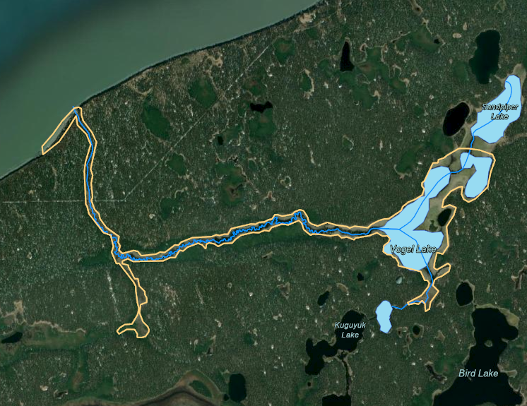

# Rotenone monitoring

```{r , include=FALSE}
knitr::opts_chunk$set(echo = TRUE, warning = F, message = F)

# clear environment
rm(list=ls())

# load packages
library(bookdown)
library(tidyverse)
library(googlesheets4)
library(lubridate)
library(readr)
library(readxl)
library(writexl)
library(fs)
library(janitor)
library(hms)
library(plotly)
library(DT)
library(xlsx)
library(leaflet)
library(DT)
library(ggpubr)
library(plotrix)
library(packrat)
library(magrittr)
library(kableExtra)

# set plotting themes

## geom_col plots theme
col_theme <- theme(axis.title = element_text(size = 14, face = "bold"),
                   strip.text = element_text(size = 14, face = "bold"),
                   legend.title = element_text(size = 14, face = "bold"),
                   legend.text = element_text(size = 14),
                   axis.text = element_text(size = 14))

## geom_points plots theme
points_theme <- theme(axis.title = element_text(size = 14, face = "bold"),
                   strip.text = element_text(size = 14, face = "bold"),
                   legend.title = element_text(size = 14, face = "bold"),
                   legend.text = element_text(size = 14),
                   axis.text = element_text(size = 11, face = "bold"),
                   title = element_text(size = 18))

# function to exclude multiple items per column
'%ni%' <- Negate('%in%')

# clarify select function
select <- dplyr::select
```

Rotenone application was performed in early October 2021 by ADF&G staff. The treated bodies of water included Vogel Lake, North Vogel Lake, and Miller Creek. ADF&G collected pre and post-treatment water samples as part of the treatment event, and Kenai Watershed Forum monitored degradation through Summer 2022 when levels fell to undetectable.

Field sampling and analytical methods generally followed those described in [Couture et al. 2022](https://www.sciencedirect.com/science/article/pii/S0045653521029507?casa_token=ay4PaETNCSQAAAAA:_IZ-AVNjAqJ4cdwnVLYAoXmbG5KvzPbpQ8aTeu54QqIzDietLnk1Xe_uj5z93IzrNsoCRwsSOaM). Prior to rotenone treatment, we collected a composite grab sample from two locations at a depth of 0.5 m near the center of each lake. Following treatment, we collected lake water samples at a depth of 0.5 m from two locations around the center of the lake either as a grab sample or with a Kemmerer sampler. For each strata of each lake, a single composite sample was created from the two locations. For benthic samples, the Kemmerer sampler was lowered to a depth within 2 m from the bottom in the same two locations around the center of the lake. The collected water from two locations was then combined into a single 1 L composite sample. All samples were collected into sterilized 1 L amber glass bottles, immediately chilled on ice, stored out of the light and transported to the Applied Science, Engineering and Technology (ASET) Lab located at the University of Alaska Anchorage (UAA) within 72 h of collection. Upon arrival to the lab all samples were stored in the dark at 4°C and analyzed via high performance [liquid chromatography](https://www.sciencedirect.com/topics/earth-and-planetary-sciences/liquid-chromatography "Learn more about liquid chromatography from ScienceDirect's AI-generated Topic Pages") tandem mass spectrometry (HPLC-MS/MS) within seven days of collection.

## Sampling schedule

The rotenone sampling schedule is described in table \@ref(tab:sample-schedule) or may be accessed in a Google Sheet linked here: <https://tinyurl.com/8ba94nrn>. The schedule is current as of `r Sys.Date()`.

```{r sample-schedule, echo = F, fig.cap = "cap"}
options(knitr.kable.NA = '')

# read in proposed schedule
url <- "https://docs.google.com/spreadsheets/d/1_lv-I471tu8WI55nItGslKYe_X5qvwZ_MF22M2jrkZo/edit#gid=0"
tab <- "rotenone_sample_schedule"
dat <- read_sheet(url, sheet = tab) 

# create table
dat %>%
  kbl(caption = "Vogel lake and Miller Creek rotenone sampling schedule") %>%
  kable_paper(full_width = F, html_font = "Cambria") 

#%>%
 # bootstrap_options = c("striped", "hover", "condensed", "responsive")
```

## Rotenone sampling map

[{width="500"}](https://arcg.is/1GeLTX)

Click the image above to access the online map at <https://arcg.is/1GeLTX>. The map layer titled "Rotenone Sampling" contains interactive click-able points with sampling details including coordinates.

<br>

## Rotenone concentration results

```{r, data prep, echo = F}

# prepare data for summary and visualization

# read in all rotenone concentration data from csv files (sourced from excel files emailed from UAA)
data_dir <- "input/rotenone_data/rotenone_concentration_results/csv/"

rot_dat <- data_dir %>% 
  dir_ls(regexp = "\\.csv$") %>% 
  map_dfr(read_csv, .id = "source") 

# clean up very messy import

## rename
column_names <- c("source",
                  "sample_name",
                  "field_sample_date",
                  "lab_analysis_date",
                  "rotenone_ppb",
                  "rotenolone_ppb",
                  "deguelin_ppb",
                  "tephrosin_ppb",
                  "cft_5",
                  "cft_6")
colnames(rot_dat) <- column_names 

## remove empty columns
rot_dat <- remove_empty(rot_dat)

## remove empty rows and column name rows
rot_dat <- rot_dat %>%
  filter(!is.na(sample_name)) %>%
  filter(field_sample_date != "---") %>%
  filter(sample_name %ni% c("Sample Name*",
                            "*a and b denote separate extraction duplicates",
                            "**ND = Not Detected"))  %>%
  
## separate sample names into columns to better organize them
### distinguish a and b lab duplicates
  separate(sample_name,into = c("sample_name","lab_dup"), sep = "_") %>%
  
### correct for use of "benthic" vs "deep" terminology in sample names
  mutate(sample_name = str_replace(sample_name, pattern = "Vogel Deep", replacement = "Vogel Benthic")) 

# convert dataframe to long format (pivot all parameter results)
rot_dat <- rot_dat %>%
  pivot_longer(cols = c("rotenone_ppb", "rotenolone_ppb", "deguelin_ppb", "tephrosin_ppb", "cft_5", "cft_6"),
               names_to = "parameter",
               values_to = "val_ppb")

# add designation to values provided as "< 0.5" to allow for conversion to numeric column
rot_dat <- rot_dat %>%
  mutate(detection_note = 
           case_when(
             val_ppb == "<0.5" ~ "value <0.5 ppb",
             val_ppb == "ND" ~ "Not_Detected",
             val_ppb == "Detected" ~ "Detected")) %>%
  # remove "<" symbols from value column
  mutate(val_ppb = str_replace(val_ppb, "<", ""))

# convert value column to numeric, leaving detection limit notes only in new val_ppb column
rot_dat <- rot_dat %>%
  mutate(val_ppb = as.numeric(val_ppb))
  
## transform other column types
rot_dat <- rot_dat %>% 
  transform(field_sample_date = mdy(field_sample_date),
            lab_analysis_date = mdy(lab_analysis_date))

## clarify values in relation to detection limit notes
rot_dat <- rot_dat %>%
  mutate(val_ppb = case_when(
    detection_note == "Not_Detected" ~ "0",
    detection_note == "value <0.5 ppb" ~ "0",
    TRUE ~ as.character(val_ppb))) %>%
  # convert value column to numeric now that we've removed all characters
  mutate(val_ppb = as.numeric(val_ppb))


```

```{r, sample name correction , echo = F}
# sample name correction

# the samples collected 9/27/2021 and 9/28/2021 at Vogel and North Vogel were collected from the surface, but the sample names do not contain the word "Surface." Apply this correction to be consistent with other sample name conventions.

# also: clarify "Vogel A" and "Vogel B" from 2/22/2022. These are surface samples from two different littoral locations around Vogel Lake. For these purposes, we will still just call these "Vogel Lake Surface. Keep seperate for now (1 and 2) until plotting

rot_dat <- rot_dat %>%
  mutate(sample_name = case_when(
    sample_name == "Vogel" | field_sample_date == "2021-09-27" ~ "Vogel Surface",
    sample_name == "N. Vogel" | field_sample_date == "2021-09-28" ~ "N. Vogel Surface",
    sample_name == "Vogel A"  | field_sample_date == "2022-02-22" ~ "Vogel Surface 1",
    sample_name == "Vogel B"  | field_sample_date == "2022-02-22" ~ "Vogel Surface 2",
    TRUE ~ sample_name))  %>%
   
  # add column designation for benthic vs surface vs creek
  mutate(strata = word(sample_name,-1)) %>%
  mutate(strata = ifelse(strata == "Surface" | strata == "Benthic",strata,"Creek")) %>%
  
  # modify sample names to remove spaces
  mutate(sample_name = case_when(
    sample_name == "Vogel Surface" ~ "Vogel_Surface",
    sample_name == "Vogel Surface 1" ~ "Vogel_Surface_1",
    sample_name == "Vogel Surface 2" ~ "Vogel_Surface_2",
    sample_name == "N. Vogel Surface" ~ "N_Vogel_Surface",
    sample_name == "Vogel Benthic" ~ "Vogel_Benthic",
    sample_name == "N. Vogel Benthic" ~ "N_Vogel_Benthic",
    sample_name == "Miller Creek 1" ~ "Miller_Creek_1",
    sample_name == "Miller Creek 2" ~ "Miller_Creek_2",
    sample_name == "Miller Creek Weir" ~ "Miller Creek Weir")) %>%
  
  # add column to designate water body
  mutate(waterbody = case_when(
    sample_name ==  "Vogel_Surface" | sample_name == "Vogel_Benthic" ~ "Vogel_Lake",
    sample_name =="N_Vogel_Surface" | sample_name == "N_Vogel_Benthic" ~ "N_Vogel_Lake")) %>%
  mutate(waterbody = ifelse(!is.na(waterbody), waterbody, "Miller_Creek"))

## 3/11/2022 get new sample/site names incorporated -- Vogel Surface 1 and 2, change so iut's all just "Vogel Surface"

## NOTE: samples from Vogel Lake 2022-02-22 are labeled as sites "1" and "2", as they are both from different surface locations. They will be designated as just "surface" without distinguishing sites at a later step.


```

```{r, lab-dups, echo = F}

# address lab duplicates. calculate percent difference among lab dups, then finalize into average values for plotting/summary tables

# what is the % difference among rotenone lab duplicates?
pct <- rot_dat %>%
  filter(parameter == "rotenone_ppb") %>%
  
  # reshape dataframe
  select(parameter,sample_name,field_sample_date,lab_dup,val_ppb) %>%
  filter(!is.na(lab_dup)) %>%
  pivot_wider(names_from = lab_dup, values_from = val_ppb) %>%
  
  # calculate percent diff
  mutate(pct_diff = abs((a-b)/(a+b))) %>%
  
  # replace NaN with zeros in pct diff column
  mutate_at(vars(pct_diff),~replace(., is.nan(.), 0)) 
  
# average pct diff
avg_pct_diff <- pct %>% 
  summarise(avg_pct_diff = mean(pct_diff)*100) %>% 
  as.numeric() 
avg_pct_diff <- format(round(avg_pct_diff,2), nsmall = 2) %>%
  as.character()
  
# stdev pct diff
sd_pct_diff <- pct %>% 
  summarise(sd_pct_diff = sd(pct_diff)*100) %>% 
  as.numeric()
sd_pct_diff <- format(round(sd_pct_diff, 2), nsmall = 2) %>%
  as.character()

#### insert avg and sd values inline text

```

```{r, echo = F}

# modify sample names from Vogel Lake 2022-02-22 so that they are both just "surface" rather than "surface 1" and "surface 2"

rot_dat %<>%
  mutate(sample_name = case_when(
    sample_name == "Vogel_Surface_1" ~ "Vogel_Surface",
    sample_name == "Vogel_Surface_2" ~ "Vogel_Surface",
    TRUE ~ sample_name
  ))

```

### Sample results

#### Tables

Laboratory analysis of water samples is performed by the [ASET Laboratory](https://www.uaa.alaska.edu/academics/college-of-arts-and-sciences/departments/chemistry/aset_lab/) at the University of Alaska Anchorage Department of Chemistry in Anchorage, Alaska. Detailed analytical methods can be found in [Couture et al. 2022](https://www.sciencedirect.com/science/article/pii/S0045653521029507?casa_token=ay4PaETNCSQAAAAA:_IZ-AVNjAqJ4cdwnVLYAoXmbG5KvzPbpQ8aTeu54QqIzDietLnk1Xe_uj5z93IzrNsoCRwsSOaM).

Original results received from UAA are available for download at the following link:

-   [Link: Rotenone Degradation Laboratory Results](https://github.com/Kenai-Watershed-Forum/Miller_Creek_Vogel_Lake_WQX/tree/main/input/rotenone_data).

A table of final results that have been integrated into a single dataframe and reshaped to a "long" format are available for download at the the following link:

-   [Link: Rotenone Degradation Final Results](https://github.com/Kenai-Watershed-Forum/Miller_Creek_Vogel_Lake_WQX/tree/main/output/rotenone_results)

A summarised version of the above downloadable table is displayed in Table \@ref(tab:rotenone-table). Values shown in Table \@ref(tab:rotenone-table) are averages of duplicate lab values (overall mean percent difference = `r avg_pct_diff` ± `r sd_pct_diff` %, mean ± SD).

```{r, results table, echo = F}
# save full table to github repo available for download
write.csv(rot_dat,"output/rotenone_results/rotenone_results.csv", row.names = F)
```

<br>

```{r, rotenone-table, echo = F}

# create table
rot_dat %>%
  filter(parameter == "rotenone_ppb") %>%
  arrange(waterbody,field_sample_date) %>%
  group_by(sample_name, field_sample_date, waterbody, strata,detection_note) %>%
  summarise(rotenone_ppb = mean(val_ppb)) %>%
  select(sample_name, field_sample_date, waterbody, strata, rotenone_ppb,detection_note) %>%
  kbl(caption = "Rotenone results. See above download link\nfor complete analysis results, including other parameters (rotenolone, deguelin, and others.)") %>%
  kable_paper(full_width = F, html_font = "Cambria")

```

<br>

#### Figures

```{r, echo = F, fig.cap = "Average rotenone concentrations in Vogel Lake and North Vogel Lake, Fall 2021 through Spring 2022. "}

    ## lakes plot

    ggplotly(rot_dat %>%
        # remove miller creek
        filter(waterbody != "Miller_Creek",
               parameter == "rotenone_ppb") %>%
        group_by(sample_name,field_sample_date, waterbody,strata) %>%
        summarise(avg_rotenone_ppb = mean(val_ppb)) %>%
        ggplot(aes(field_sample_date,avg_rotenone_ppb, color = strata)) +
        geom_point() +
        geom_line() +
        facet_grid(. ~ waterbody) +
          xlab("") +
          ylab("Rotenone Concentration (ppb)") +
        ggtitle("Rotenone Concentrations 2021 - 2022")
      )

```

<br>

**Note on Miller Creek results:**

-   Rotenone values for Miller Creek are not shown in a continuous time series figure due to more limited sample results from varying locations. See Table \@ref(tab:rotenone-table) for results from Miller Creek.
